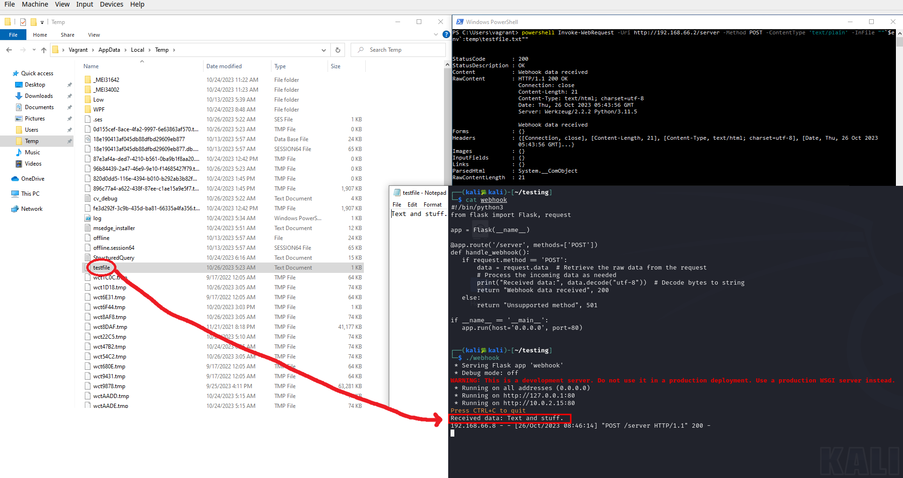
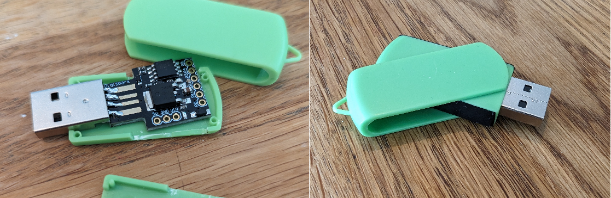
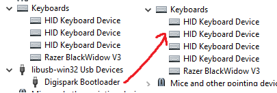

Always consider the local laws and ethical ramifications when doing pentesting

Our YouTube channel: https://www.youtube.com/@phishsticks_pentest/videos

---

### [Week 43](notes/week43.md)

#### Living in the fast lane

The week has barely started and we have a working keylogger script. No. Scratch that. We have **two**. We worked around the issues [sawulohi](https://github.com/sawulohi/) faced last week by switching platforms from Windows to Linux, and made some changes to the source material.

[miljonka](https://github.com/miljonka/) used [a python script that sends the logged data via email to the attacker](notes/rajala/notes.md#24102023)

[therealhalonen](https://github.com/therealhalonen/) chose to [obfuscate his powershell script with base64](notes/halonen/notes.md#24102023), and to send the data via [a HTTP POST](notes/halonen/notes.md#26102023).

**Both methods bypass Windows Defender**

#### Should you use a HTTP POST or email when sending your keylogger data?

Obviously we need to make a choice between the two methods. The team pondered between the pros and cons between the two. Here's a brief summary of our thoughts.

| email | HTTP POST |
| --- | --- |
| + easier to implement (using existing services) | - difficult to implement |
| - more difficult to implement encryption | + easier to implement encryption |
| - gives away more info about the attacker | + gives some info, but not as much |
---

### [Week 41](notes/week41.md)

#### Oneliners make you cooler (and you run faster too!)

The payloads written by [miljonka](https://github.com/miljonka/) and [therealhalonen](https://github.com/therealhalonen/) are now oneliners that execute from Windows Run. This results in the Digispark executing faster than previously, check out the notes from [therealhalonen](https://github.com/therealhalonen/PhishSticks/blob/master/notes/halonen/notes.md#12102023) and [miljonka](https://github.com/therealhalonen/PhishSticks/blob/master/notes/rajala/notes.md#11102023) for details!

[sawulohi](https://github.com/sawulohi/) ran into some [problems](https://github.com/therealhalonen/PhishSticks/blob/master/notes/ollikainen/notes.md#keylogging-with-digispark) with trying out demo code for the keylogger. Yikes!

There is also a new [Vagrant file](https://github.com/therealhalonen/PhishSticks/blob/master/notes/halonen/notes_res/Vagrantfile) for creating a virtual machine running Windows 10. This will expedite running tests in our lab environments on fresh systems. Testing should be ran on multiple instances in case you modify settings on older virtual machines and forget about it.

The payloads for reverse shell and ransomware are closing in on a demoable state, and it's quite likely that the team will focus on keylogging next...

Week 42 will be devoted to refreshing our minds (in other words, autumn holiday), so no work will be seen from that week. Rest is important for your brains!

---

### [Week 40](notes/week40.md)

#### Do you know what's in your phishsticks?

[therealhalonen](https://github.com/therealhalonen/) made a physical BadUSB-prototype! Fittingly scary, Halloween is just around the corner 😱👻

This week has sailed on the sidetracks, but it's all for the greater good & end results. And we firmly believe, that adapting workloads to fit weekly wants and motivations is good for the soul (a happy worker is a productive worker).

[therealhalonen](https://github.com/therealhalonen/) also made [a Finnish layout for Digisparks DigiKeyboard](https://github.com/therealhalonen/DigiKeyboardFi)(GitHub repository link)

[miljonka](https://github.com/miljonka/) made some progress on converting his [Python payload into an executeable file](https://github.com/therealhalonen/PhishSticks/blob/master/notes/rajala/notes.md#4102023):

[sawulohi](https://github.com/sawulohi/) worked on [changing the vendor & product id of the Digispark](notes/ollikainen/notes.md#changing-usb-vid--pid-on-digispark), ~~but to no avail~~ the changes were made, but they might be hard to find for the average user (which we - of course - are not). Testing on the subject will continue, as spoofing the ID of the device makes for good subterfuge.

We also produced a [python script](/notes/halonen/update_usbconfig.py) to automate the formatting of VID/PID into the usbconfig.h file. Databases containing VID/PID information often offer the bytes in a different format than what is used in the config files of the Digispark.

---

### Update on week 39

The Digisparks arrived! Hooray!

[miljonka](https://github.com/miljonka/) made [a preliminary GUI](notes/rajala/notes.md#**26.9.2023**) for his ransomware demo.

[therealhalonen](https://github.com/therealhalonen/) started testing [with Arduino IDE and the DigiSpark](https://github.com/therealhalonen/PhishSticks/blob/master/notes/halonen/notes.md#2992023).

[sawulohi](https://github.com/sawulohi/) waded through (boring) [management stuff](notes/ollikainen/notes.md#week-39), such as [creating a YouTube channel for the project](https://www.youtube.com/@phishsticks_pentest/videos) (please subscribe and like our videos!) We are proud to announce that our [Flipper Zero demo](https://www.youtube.com/watch?v=1kqqIdBoKr0) has already reached 23 views as of 2.10.2023! [sawulohi](https://github.com/sawulohi/) also wrote up instructions on how to start [uploading code to your own Digispark with the Arduino IDE](/notes/ollikainen/notes.md#digispark)

### [Week 39](notes/week39.md)

#### Good news everybody! Progress has been made!

[therealhalonen](https://github.com/therealhalonen/) wrote up some preliminary scripts for us to use and research in the project. There is a [demo for the reverse shell using Flipper Zero BadUSB.](notes/halonen/notes.md#2692023) See the video [here!](https://youtu.be/1kqqIdBoKr0)

[sawulohi](https://github.com/sawulohi/) will be looking up the example script [therealhalonen](https://github.com/therealhalonen/) provided that was written by [Mohamed Ezzat] (https://mohamedaezzat.github.io/posts/keylogger/)(licensed under CC BY 4.0 by the author.) to see if it's usable for the project. There is also research to be made about passthrough-capabilities for the keylogger, as well as actually sending the information.

[miljonka](https://github.com/miljonka/) wrote up a script based on [a video by NetworkChuck on creating ransomware with Python](https://www.youtube.com/watch?v=UtMMjXOlRQc). This week [miljonka](https://github.com/miljonka/) will be researching creating a GUI for the ransomware (possibly with [tkinter?](https://docs.python.org/3/library/tkinter.html)).

More testing & research is required, but everyone has a set direction and a goal to move towards.

#### Also. Bad news everybody! New risks on the horizon

The DigiSparks ordered through Amazon are still in transit. Hopefully someones dog hasn't eaten our homework \:\( . Tracking codes were provided, but they are not working. Will be looking to pick up DigiSparks from a physical vendor later this week.

---

### [Week 38](notes/week38.md)

Work has begun. We've made this GitHub page for following the progress on the project. See the [notes for this week](notes/week38.md).

---

# About

PhishSticks is a project made for [the Infra Project 2023 course](https://terokarvinen.com/2023/infra-project-2023/).

The goal of the project is to create a tool for ethical pentesting by making a simulated attack using a malicious USB device. The different types of malware include a keylogger, ransomware and reverse shell. [therealhalonen](https://github.com/therealhalonen/) [made a demo](https://github.com/therealhalonen/PhishSticks/tree/master/payloads/revshell_demo) that showcases a simple reverse shell that phones home (and bypasses Windows Defender with default settings!).

The target for the simulated attacks will always be a machine running Windows 10 on default settings.

The project will be finalized by 12.12.2023. All work noted here before the date is to be considered WIP.
