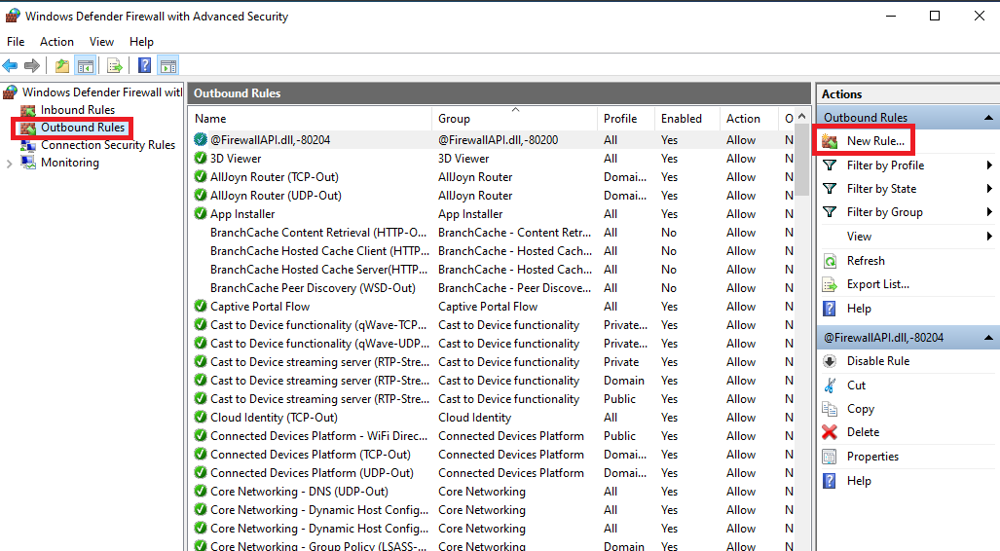
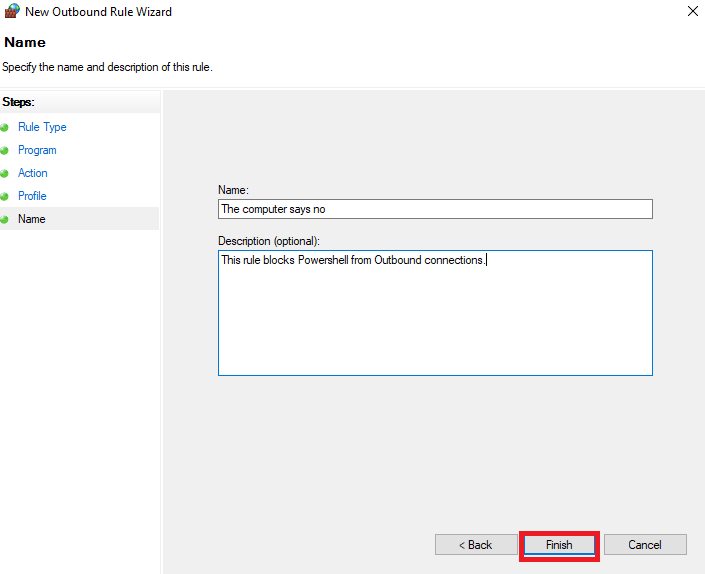
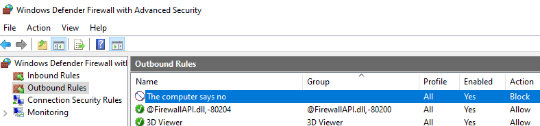
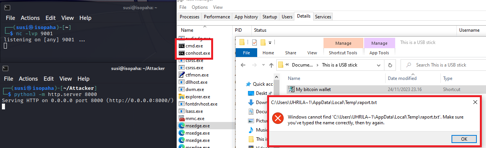

# Mitigations

## Don't plug in unknown USB devices!

The easiest mitigation of all.  Plugging in unknown devices to your computer (or even mobile phone!) is a HUGE security risk that is VERY easy to avoid. The whole point of our project (besides being a learning opportunity) was to demonstrate the dangers of BadUSB.

BadUSB is bad.

---

## Disable Powershell from User

Disabling Powershell usage, blocks the execution of our Digispark payloads as they all use keystroke injections to run commands in Powershell.

**Disabling Powershell from User via Group Policies:** 
Easiest way, is to open the Windows search, and type `gpedit.msc` and open.   

In Local Group Policy Editor:   
Select: User Configurations -> Administrative Templates -> System -> Don't run specified Windows applications -> Double Click

In the settings, choose: Enabled -> "List of disallowed applications" -> Show -> Value -> powershell.exe.   

Then Ok -> Ok 

Outcome:   

Now opening the Powershell gives:   

## Block Powershell from Windows firewall

If you trust your users a little more (but not all the way), you can add powershell.exe to your Windows firewall policies. This is a little less drastic than disabling Powershell altogether.

Open up your Windows Firewall settings.

Navigate to `Outbound rules` and select `New rule`

Select `Program` for your rule type -> Click Next -> Enter your path to Powershell (Path to Powershell would make for a great band name), for us it was `%SystemRoot%\System32\WindowsPowerShell\v1.0\powershell.exe` 

Click Next -> `Block` the connection -> Next -> Check tickboxes for the networks you want, we selected all 3, `Domain`, `Private` and `Public`. -> Click Next -> Name your new rule and press Finish. Now you're all set!

Now to run our reverse shell script to test with the rule in place. I opened up Task Manager and went to the 'Details'-tab to see that Powershell was not running for now, and it wasn't. Tthere's a lot of things running, but pressing the letter 'p' on my keyboard made Windows play a resounding error sound to let me know, that no applications starting with the letter 'p' were running. Also, having the apps alphabetically ordered helped double-checking:

Double clicking the malicious file on a simulated USB stick let me know a few things. First off, I got a warning that there was no `raport.txt` to open up. That means, that no connection was made to the attacker to get the necessary files for our attack. Secondly, I didn't manage to screenshot the Powershell.exe running, but there was still the anomaly of a cmd.exe and conhost.exe running. The cmd.exe was probably just for the warning, as it stopped running when i clicked ok on the warning. 

Just to round out the testing, I disabled the rule and ran the same test again:

## Disable Windows Run from User

This one is more effective way against our attacks, as it still allows the usage of Powershell for User. Powershell is a useful tool, and it can be leveraged to do stuff effectively, so disabling it might not be good for business.    

To disable Run via Group Policies, open the Windows search, and type `gpedit.msc` and open.   

In Local Group Policy Editor:   
Select: User Configurations -> System -> Remove Run menu from Start Menu -> Double Click   

In settings, select: Enabled   

Then: Ok -> Ok

Outcome:   

Now trying to use Run, gives:   

## Ransomware protection - Controlled folder access
To defend yourself against, at least our ransomware, the effective way lies inside Windows own Security settings.   

Go to: Windows Security -> Virus & threat protection -> Manage settings -> Manage Controlled folder access -> On   

This prevents the running of our ransomware, giving the following notification:   

*During testing, there weren't any folders that this wouldn't cover.*
**Also, this didn't defend against the keylogger or reverse shell.**

### Disabling removable devices
This one is quite a heavy measure...    
**So this would be effective against our attacks, but also would disable all removable devices.**   

To disable all removable devices via Group Policies, open the Windows search, and type `gpedit.msc` and open.   
   

In Local Group Policy Editor:   
Select: Computer Configurations -> Administrative Templates -> System -> Device Installation -> Device Installation Restrictions -> Prevent installation of removable devices -> Double Click    
    
   

Enabled -> Ok

Outcomes when plugging our Digispark device in:    
   

   

