# Installing Windows 10 on a virtual machine

All testing is done (unless otherwise stated) on a computer with 
  * Processor	Intel(R) Core(TM) i7-8700K CPU @ 3.70GHz, 3696 Mhz
  * 16 GB RAM
  * GeForce GTX 1080 - series GPU
  * VirtualBox Version 6.1.26 r145957 (Qt5.6.2)

[https://www.microsoft.com/en-us/evalcenter/download-windows-10-enterprise](https://www.microsoft.com/en-us/evalcenter/download-windows-10-enterprise) can be used to obtain a .iso file. I used the English (Great Britain) 64-bit edition (not LTSC - Long-Term Servicing Channel - as I don't plan on using the virtual machines for extended periods of time).

Start up VirtualBox and select New

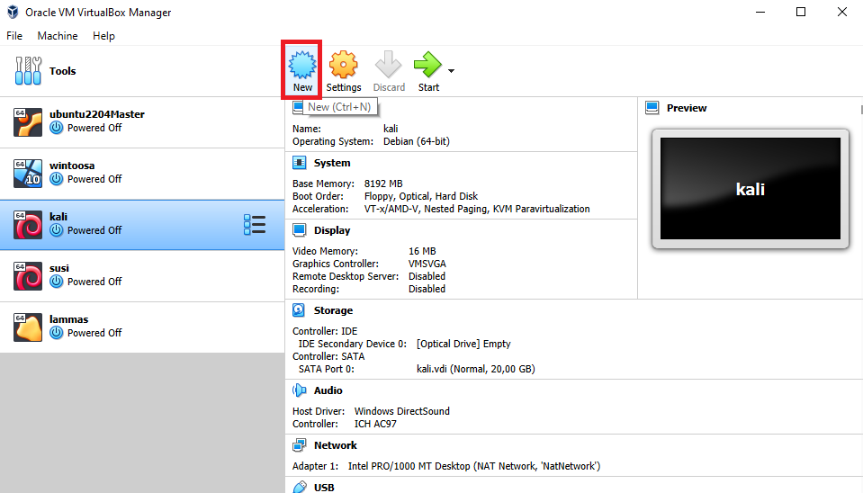

Name your virtual machine -> Set the operating system to Windows 10 -> Set the RAM to 8GB (or more if your host machine has the resources, Windows can be quite resource intensive) -> Press Create

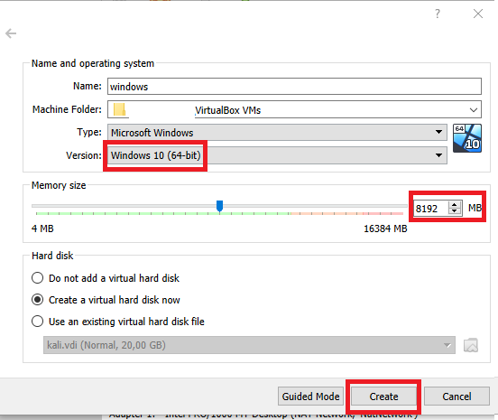

Select your desired installation path and set the size of your virtual hard drive. I'm using 50GB just to ensure I won't run into disk space problems, but less would probably be alright too. For the Hard disk file type I chose VDI, and for the storage options I selected dynamically allocated. Dynamic allocation might be slower than fixed size disks, but allow for more flexibility for storage management. See [VirtualBox documentation](https://www.virtualbox.org/manual/ch05.html) on the subject for more information.

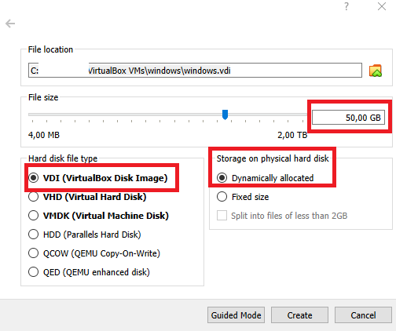

Go to the settings menu of your newly made virtual machine (right-click or otherwise) -> System -> Processor tab -> Set the amount of processors to (at least) 4. -> OK

Start up your virtual machine. VirtualBox should ask you for installation media. Press 'Add', and select your downloaded Windows .iso. My file was 5,17GB in size. Choose it and press Start.

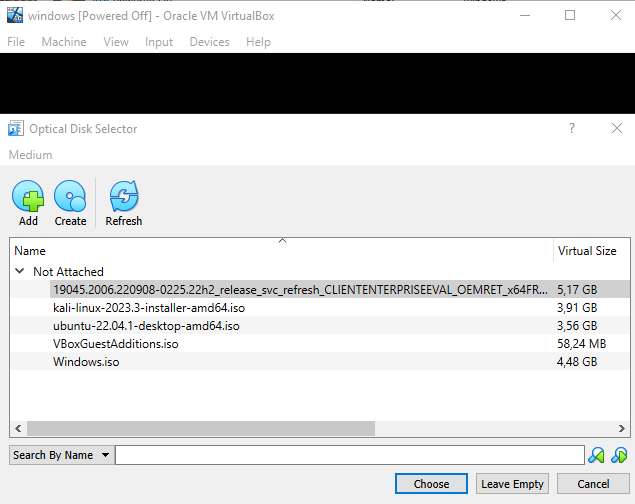

Windows setup will ask you for locale info. Select the Time and currency format -> Finnish (or whatever you want your locale to be). The keyboard should follow suit after selecting the locale. Check that the keyboard setting is correct, and proceed.

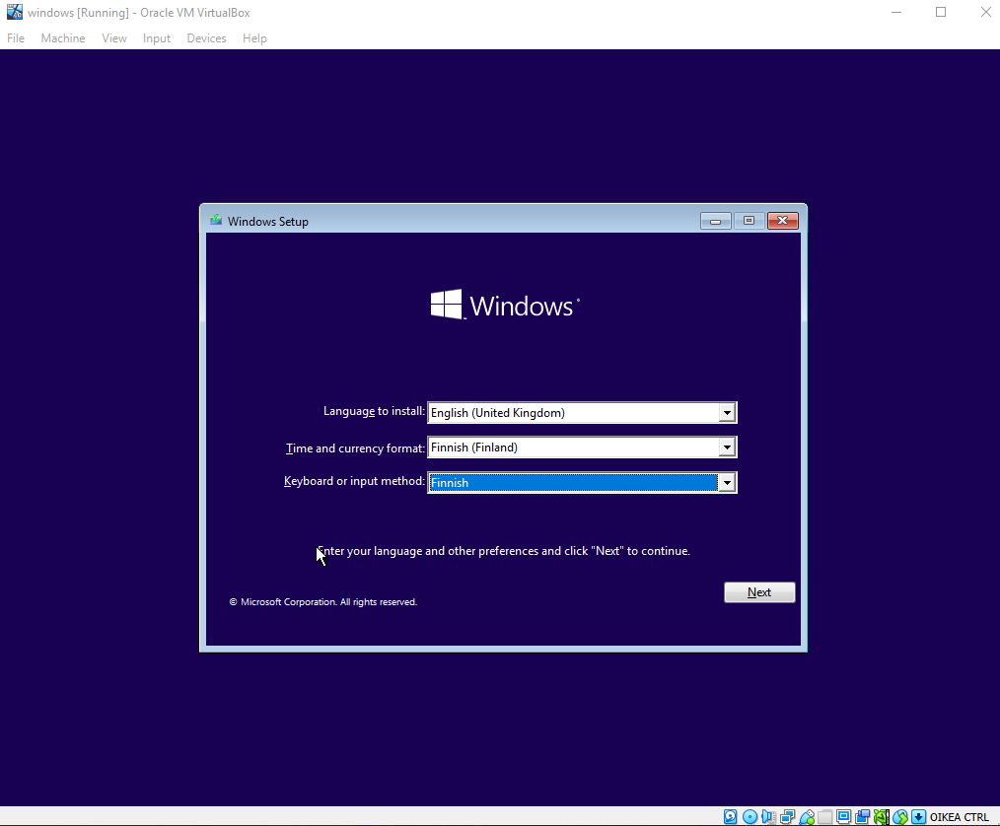

Press Install now.

Accept the license agreement. Select Custom install, as we shouldn't have an earlier version of Windows on this Virtual Machine.

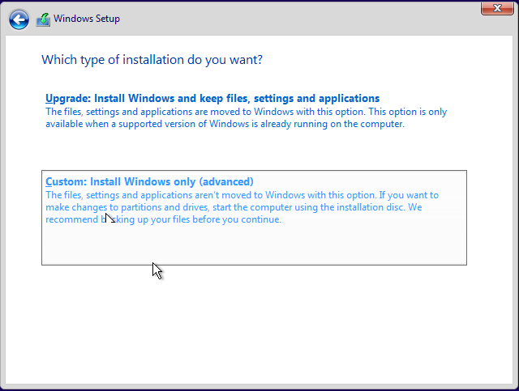

The installer will ask about the disk you want to install Windows in. Your virtual hard drive should be the only option here, so select it and proceed to install. The installation will take a while, so go make a cup of coffee or do something else as it installs.

---

After a while, Windows will start asking you (intrusive) questions about your region, your keyboard layout (again), secondary keyboard layout (skip if you selected the layout you have on your keyboard)

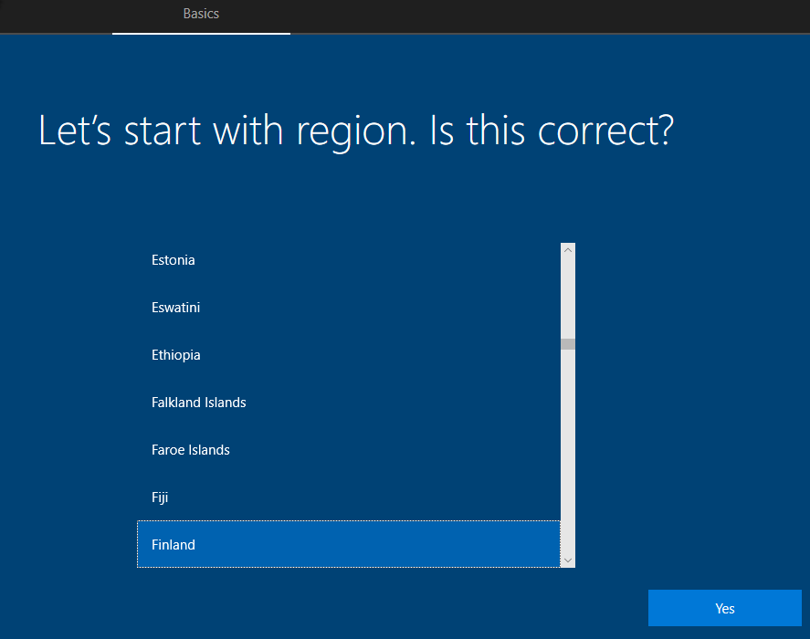

Windows will ask for a Microsoft account to login with. Instead we're selecting 'domain login'.

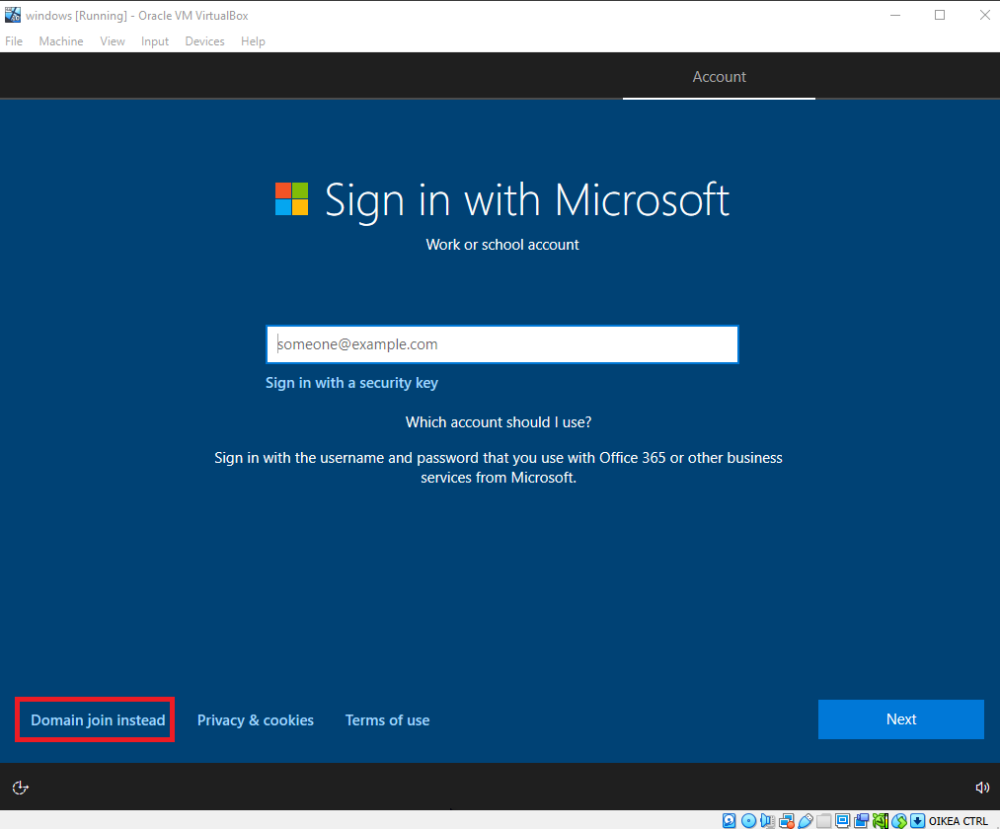

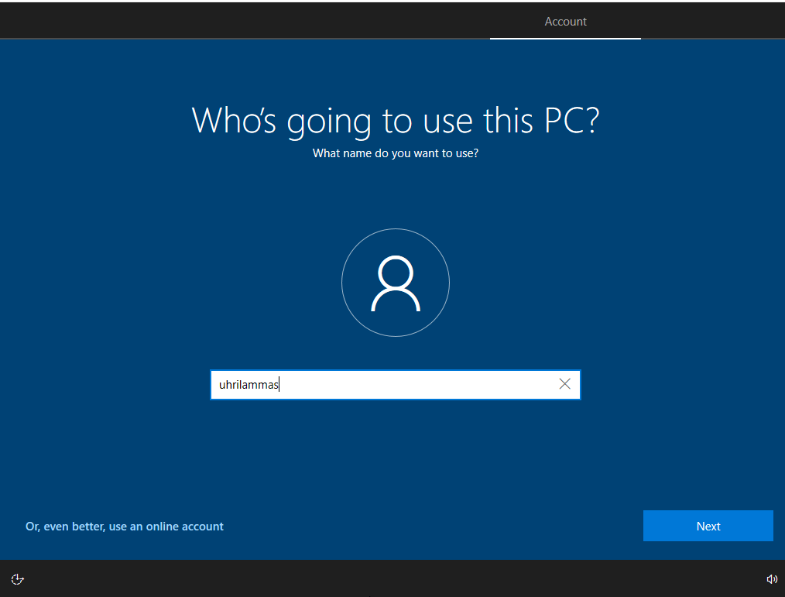

Select a secure password after these steps -> Set security questions & answers. Afterwards Windows will continue with intrusive questions on your location and using your data. Select options as you see fit (I chose to opt out and to send the least amount of diagnostics/advertisement data etc.). After these steps, theres some more waiting:

It actually took only ~2 minutes for me, and Windows was installed!

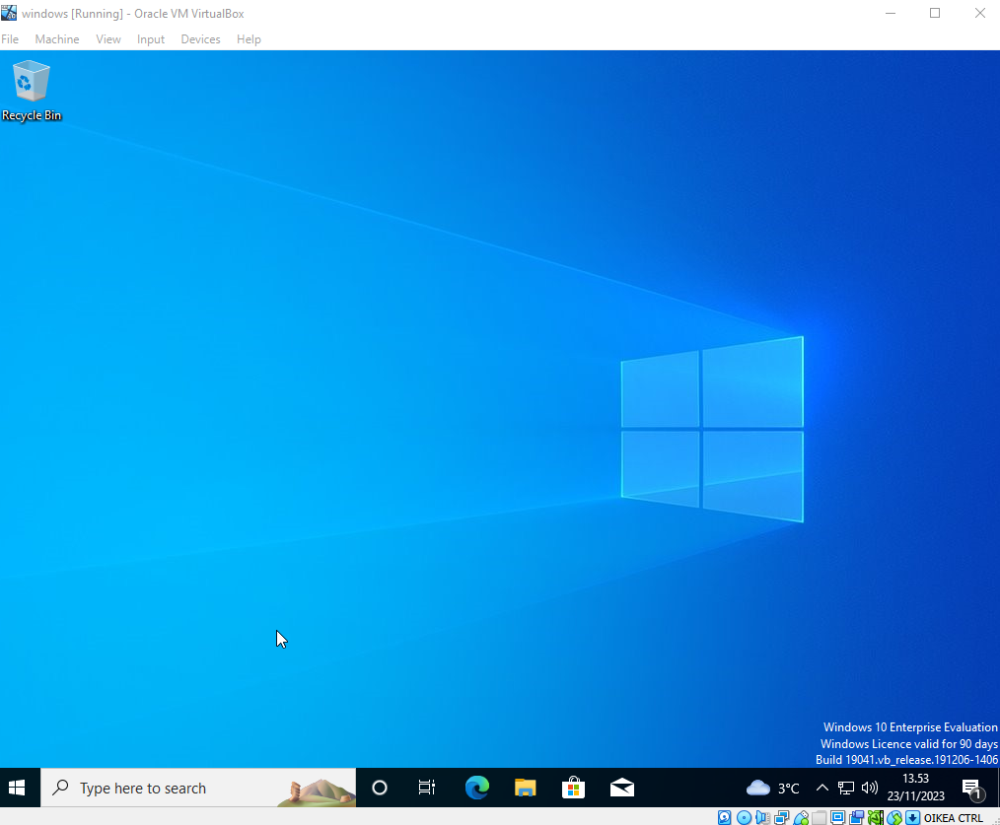

---

## Set your Windows to the same network as your attacker

Open up the settings for your Windows virtual machine -> Network -> Attach the network adapter to the same host-only connection you have your attacking machine on. For me it was VirtualBox Host-Only Ethernet Adapter #3

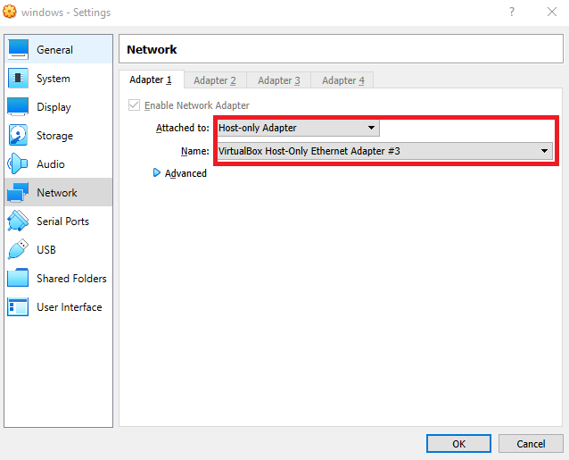

Restart your Windows machine, and test the connectivity by pinging your virtual router `ping 192.168.66.1`. I also pinged between the attacker and the target. The Windows machine could ping my Kali attacker, but my attacking machine could not ping Windows. This could be due to Windows security settings.

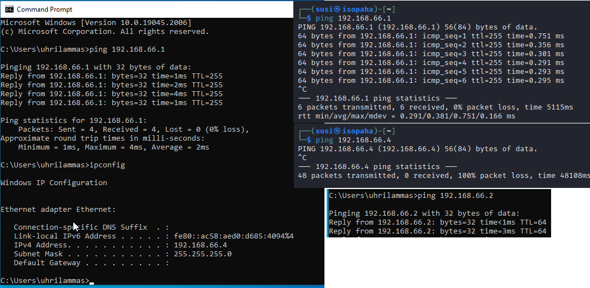

Your test lab should now be ready to go!